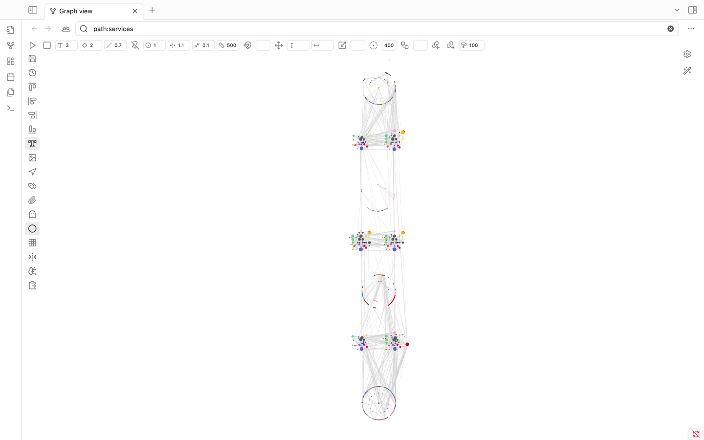

# GraphPro for Obsidian

GraphPro supercharges the native Obsidian graph view with a plethora of advanced controls, layout tools, selection enhancements, and position management features. It aims to provide a more powerful and flexible way to interact with and organize your graph.

## ✨ Features

**Layout & Position Management:**
*   **Save & Restore Positions:** Save the current node positions and restore them later.
*   **Position History:** Access a history of saved positions via right-click on the "Restore" button.
*   **Automatic Restore:** Option to automatically restore the last active node positions on startup.
*   **Undo/Redo:** In-memory undo (Ctrl/Cmd+Z) and redo (Ctrl/Cmd+Shift+Z) for position changes.
*   **Align Nodes:** Align selected nodes (start, end, vertical, horizontal).
*   **Move & Scale Selection:** Precisely move or scale selected nodes.
*   **Arrange in Circle:** Arrange selected nodes in a circular pattern around the heaviest node or with defined inner/outer circles based on ID substrings.
*   **Unlock Positions:** Unlock the fixed positions of selected nodes.
*   **Snap to Grid:** Option to snap nodes to a configurable grid when dragging.
*   **Grid Display:** Toggle a visual grid in the background.

**Selection Tools:**
*   **Area Selection:** Select nodes by dragging a rectangle while holding `Shift`.
    *   Hold `Alt` + `Shift` while dragging to deselect nodes within the rectangle.
*   **Regex Selection:** Switch the search bar to a "node selection mode" to select nodes by a regular expression matching their ID.
*   **Select Related:** Select nodes connected to the current selection, up to a specified depth.
*   **Select Backlinks/Outgoing Links:** Expand selection to include backlinks or outgoing links of currently selected nodes.
*   **Selection Status Bar:** Displays count of selected nodes and statistics about common frontmatter keys (e.g., `cluster`, `namespace`, `service`) and, for single selections, backlink/outgoing link counts and property counts with quick access to side panes.

**Display & Visuals:**
*   **Neighbor Labels:** Display labels of neighboring nodes on hover.
    *   Customize label content using Regex or a frontmatter field.
*   **Node Icons:** (Experimental) Display custom icons for nodes (requires manual configuration in `iconMap`).
*   **Selection Highlighting:** Clearly highlights selected nodes.
*   **Mirrored Core Controls:** Direct access and input fields for core graph settings like text fade, node size, link size, forces, etc., directly in the GraphPro toolbars.
*   **Additional Toggles:** Quick toggles for arrows, tags, attachments, unresolved files, orphans.

**Simulation & Force Control:**
*   **Run/Stop Simulation:** Manually start or stop the graph's force simulation.
*   **Node Weight:** Set the weight for selected nodes, influencing the force simulation.
*   **Fine-tune Forces:** Inputs to adjust center force, repel force, link force, and link distance.

**Advanced & External Interaction:**
*   **GPT Prompt Generation:** Copy a JSON representation of selected nodes (positions, colors, links, key metadata) and a base prompt to the clipboard for use with AI layout tools like GPT.
*   **Paste Positions from Clipboard:** Update node positions from a JSON object (matching the GPT prompt format) pasted from the clipboard.

**UI Enhancements:**
*   **Dedicated Control Panels:** Adds a top and a left-hand toolbar directly within the graph view for quick access to all features.
*   **Integrated Search/Selection:** Modifies the graph search bar to toggle between filtering and node selection modes.

## 🚀 How to Use

Once installed, GraphPro automatically enhances any open graph view. You'll see new control panels:

**1. Top Control Bar:**
*   ▶️ **Run simulation:** Starts the force-directed layout algorithm.
*   ⏹️ **Stop simulation:** Halts the layout algorithm, freezing nodes.
*   **T (Type icon):** Text fade threshold.
*   **◎ (Locate icon):** Node size.
*   **╱ (Slash icon):** Link thickness.
*   **📌 (Pin-off icon):** Unlock selected nodes' positions, allowing the simulation to move them.
*   **🎯 (Circle-dot icon):** Center force strength.
*   ↔️ **(Unfold-horizontal icon):** Repel force strength.
*   **⇆ (Minimize-2 icon):** Link force strength.
*   📏 **(Ruler icon):** Link distance.
*   🧲 **(Magnet icon):** Set weight for selected nodes (use adjacent input for value).
*   **(Input field for weight)**
*   ➕ **(Move icon):** Move selected nodes by X/Y offsets (use adjacent inputs).
*   ↕️ **(Move-vertical icon with input):** Vertical move offset.
*   ↔️ **(Move-horizontal icon with input):** Horizontal move offset.
*   ↔️ **(Scaling icon):** Scale selected nodes around their centroid (use adjacent input for ratio).
*   **(Input field for scale ratio)**
*   **⭕ (Circle-dot-dashed icon):** Arrange selected nodes in a circle (use adjacent input for max radius).
*   **(Input field for circle radius)**
*   **☊ (Workflow icon):** Select related nodes (use adjacent input for depth).
*   **(Input field for depth)**
*   🔗← **(Links-coming-in icon):** Select backlinks of selected nodes.
*   →🔗 **(Links-going-out icon):** Select outgoing links of selected nodes.
*   **🖌️ (Paint-roller icon with input):** Selection highlight stroke width.

**2. Left Control Bar:**
*   💾 **(Save icon):** Save current node positions. A new timestamped entry is created.
*   ↺ **(History icon):** Restore positions from the currently selected history entry.
    *   **Right-click:** Show a menu with all saved position histories. Select one to load. Also allows toggling "Auto restore on startup."
*   **‖← (Align-start-horizontal icon):** Align selected nodes to the top-most Y.
*   **↑‖ (Align-start-vertical icon):** Align selected nodes to the left-most X.
*   **↓‖ (Align-end-vertical icon):** Align selected nodes to the right-most X.
*   **‖→ (Align-end-horizontal icon):** Align selected nodes to the bottom-most Y.
*   **T□ (Type-outline icon):** Toggle display of neighbor labels on hover.
*   🖼️ **(Image icon):** Toggle display of custom node icons (if configured).
*   🧭 **(Navigation icon):** Toggle display of link arrows (mirrors core setting).
*   🏷️ **(Tags icon):** Toggle display of tags (mirrors core setting).
*   📎 **(Paperclip icon):** Toggle display of attachments (mirrors core setting).
*   👻 **(Ghost icon):** Toggle "Existing files only" (mirrors core setting).
*   ⚪ **(Circle icon):** Toggle display of orphans (mirrors core setting).
*   ▦ **(Grid icon):** Toggle display of the background grid.
*   ↔️↕️ **(Flip-horizontal-2 icon):** Toggle "Snap to grid" for node dragging.
*   🧠 **(Brain-circuit icon):** Copy GPT prompt and selected nodes' data to clipboard.
*   📋 **(Clipboard-paste icon):** Update node positions from JSON in clipboard.

**3. Search Bar Area (Top of Graph View):**
*   The standard search bar is enhanced.
*   **Ab (Whole-word icon):** Switch search to "Nodes Selection Mode". The input field will now accept a Regular Expression. Press Enter to select nodes whose IDs match the regex.
*   **♀ (Filter icon):** Switch search back to standard "Filter Mode".

**4. Node Selection:**
*   Hold `Shift` and drag the mouse to draw a selection rectangle.
*   Hold `Alt` + `Shift` and drag to deselect nodes within the rectangle.
*   Selected nodes will be highlighted. Information about the selection appears in the Obsidian status bar at the bottom.

**5. Node Dragging:**
*   When dragging a node, if other nodes are selected, they will be co-dragged, maintaining their relative positions.
*   If "Snap to Grid" is enabled, nodes will snap to the nearest grid intersection upon release.

**6. Keyboard Shortcuts:**
*   `Ctrl/Cmd + Z`: Undo last node position change.
*   `Ctrl/Cmd + Shift + Z`: Redo last node position change.

**7. "Advanced" Section in Core Graph Controls:**
*   GraphPro adds an "Advanced" section to Obsidian's native graph control panel (usually on the right).
*   **Label Regex:** A regex to extract a display label from the node ID for neighbor labels (e.g., `(?<label>.*)`).
*   **Frontmatter Field:** A frontmatter key to use for the node's display label (overrides Label Regex if the field exists and has a value).

## ⚙️ Settings

GraphPro offers several settings, accessible through the plugin's UI elements and the "Advanced" section in the core graph controls:

*   **`showIcons` (via Image icon):** Toggle visibility of custom node icons.
*   **`showNeighborLabels` (via Type-outline icon):** Toggle visibility of labels for neighbors of a hovered node.
*   **`showGrid` (via Grid icon):** Toggle visibility of the background grid.
*   **`snapToGrid` (via Flip-horizontal-2 icon):** If true, nodes will snap to the grid when dragged.
*   **`automaticallyRestoreNodePositions` (via Restore button context menu):** If true, the plugin will attempt to restore node positions from the `currentPositionsHistoryKey` when the graph is opened.
*   **`currentPositionsHistoryKey` (managed internally, selected via Restore button context menu):** Stores the key/timestamp of the position history to be used for auto-restore or manual restore.
*   **`labelRegex` (Advanced graph controls):** A JavaScript regular expression with a named capture group `label` (e.g., `^(?:nodes\/)?(?<label>[^\/]+?)(?:\.md)?$`) to extract a cleaner label from the node ID for neighbor labels.
*   **`frontmatterField` (Advanced graph controls):** The name of a frontmatter field (e.g., `title`, `alias`) to use for neighbor labels. If a node has this field, its value will be used as the label; otherwise, `labelRegex` will be attempted.
*   **`selectionWidth` (Top bar input):** The thickness of the highlight stroke around selected nodes.
*   **`maxArrangeCircleRadius` (Top bar input):** The maximum radius used when arranging selected nodes in a circle.
*   **`searchSelectionMode` (managed internally, toggled via search bar icons):** Determines if the graph search input is used for filtering or regex-based node selection.

Position history is saved as JSON files in `.obsidian/plugins/graph-pro/position-history/`.
Plugin settings are saved in `.obsidian/plugins/graph-pro/data.json`.

## 💾 Installation

1.  Ensure you have Obsidian installed.
2.  Install BRAT (Beta Reviewers Auto-update Tester) from the Community Plugins section in Obsidian.
3.  Open the command palette (Ctrl/Cmd+P) and run "BRAT: Add a beta plugin".
4.  Paste the URL of this repository `https://github.com/Air-Mark/graph-pro` into the dialog.
5.  Enable "GraphPro" in the "Community Plugins" tab in Obsidian's settings.

*(Alternatively, for manual installation:)*
1.  Download the `main.js`, `manifest.json`, and (if any) `styles.css` from the latest release.
2.  Create a new folder named `graph-pro` inside your Obsidian vault's `.obsidian/plugins/` folder.
3.  Copy the downloaded files into the `graph-pro` folder.
4.  Go to Settings -> Community Plugins in Obsidian and enable "GraphPro".

## ⚠️ Known Issues / Limitations

*   The `iconMap` for custom node icons is currently hardcoded and empty in the provided source. To use custom icons, this map would need to be populated manually in the code or a UI for managing it would be needed.

## 🤝 Contributing

Contributions, issues, and feature requests are welcome! Please feel free to check the issues page.

---

This README provides a comprehensive overview. Let me know if you'd like any section expanded or clarified!